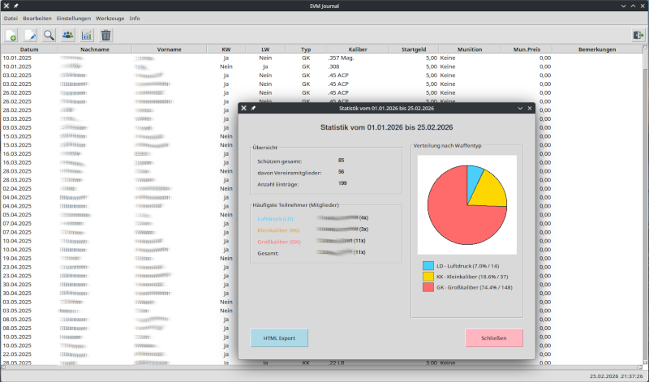

# SVM-Journal

## Journal für kleinere bis mittlere Schießsportvereine, für die regelmäßige Dokumentation der Aktivitäten auf dem Schießstand.



In meinem Schießsportverein wurde der Schießbetrieb und die Mitgliederverwaltung bisher auf diversen, zweckentfremdeten Excel Tabellen und Word Dokumenten  dokumentiert. Davon ist im Laufe der Zeit eine große Anzahl entstanden, voller Inkonsistenzen und Fehlern. Um ein bisschen Ordnung in die Verwaltung zu bringen habe ich nach einer, für kleine Vereine geeigneten, Software gesucht, wurde aber nicht fündig. Aus diesem Grund habe ich mich entschlossen, mit Hilfe von [Claude (Anthropic)](https://claude.ai/) für Abhilfe zu sorgen. **SVM Journal** ist das Ergebnis. Weitere Funktionen werden hinzukommen, wenn in meinem Verein Bedarf dafür besteht.

## Systemvoraussetzungen

SVM Journal setzt einen Tcl/Tk Interpreter voraus.

Unter Linux lässt sich  Tcl/Tk, sofern nicht schon vorhanden, aus den Repositorys installieren.

**Debian** / **Ubuntu**:

```bash
sudo apt install tcl tk
```
**RedHat** / **Fedora** / **SUSE**:

```bash
sudo dnf install tcl tk
```
**Arch Linux**:

```bash
sudo pacman -S tcl tk
```

Unter **Windows** empfiehlt sich die Installation von [Magicsplat Tcl/Tk for Windows](https://www.magicsplat.com/tcl-installer/index.html).


## Installation und Start

Eine Installation ist nicht erforderlich. Einfach den Ordner svm-journal an die gewünschte Stelle kopieren. Unter Linux bietet sich /opt an, unter Windows C:\Programme.

Das Programm startet man mit:
```bash
./svm-journal.tcl
```
oder
```bash
wish svm-journal.tcl
```

Beim ersten Start werden automatisch alle benötigten Verzeichnisse im User-Daten-Bereich erstellt:
- **Linux:** `~/.config/svm/`
- **Windows:** `%APPDATA%\SVM\`

Alle JSON-Dateien und Benutzerdaten werden dort gespeichert, das Programm-Verzeichnis bleibt unverändert.

## Features

### Mitgliederverwaltung
- Vollständige Verwaltung von Vereinsmitgliedern mit Kontaktdaten
- Suchfunktion mit Live-Filterung
- Automatische Backup-Erstellung beim Löschen von Mitgliedern

### Journal-Einträge
- Erfassung von Schießstand-Aktivitäten mit Datum, Person, Waffentyp und Kaliber
- Automatische Berechnung des Startgeldes basierend auf Mitgliedschaft und Waffentyp (Luftdruck, Kleinkaliber, Großkaliber)
- Unterscheidung zwischen Mitgliedern und Gästen mit unterschiedlichen Preisen
- Autovervollständigung für Mitgliedernamen
- Munitionsauswahl mit automatischer Preisberechnung

### Export-Funktionen
- Export nach Markdown (.md) und HTML (.html)
- Zeitraum-Filter für den Export (Alle oder spezifischer Zeitraum)
- Personen-Filter für individuelle Auswertungen

### Munitionspreise
- Verwaltung von Kalibern und zugehörigen Preisen
- Einfache Anpassung der Munitionspreise über einen Dialog

### Datenverwaltung
- JSON-basierte Datenspeicherung für einfache Portabilität
- Automatische Archivierung von Vorjahres-Einträgen
- Sortierte Anzeige aller Einträge nach Datum und Uhrzeit
- Löschen von Einträgen per Rechtsklick-Kontextmenü

### Benutzeroberfläche
- Übersichtliche Tabellen-Darstellung aller Einträge
- Intuitive Bedienung


